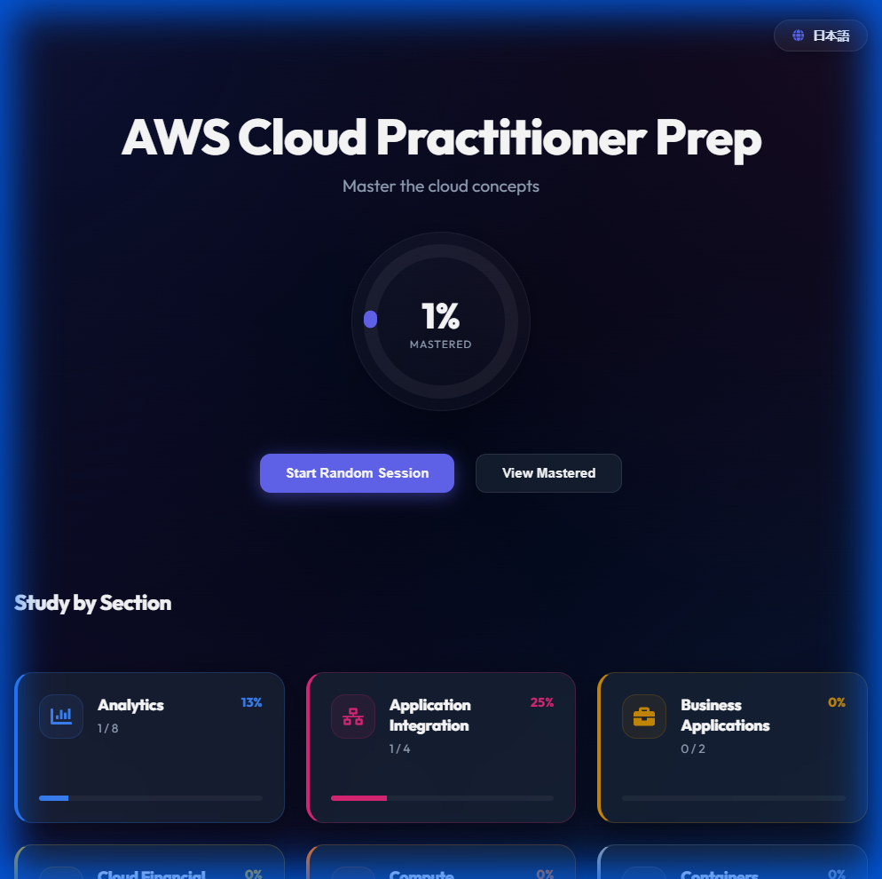
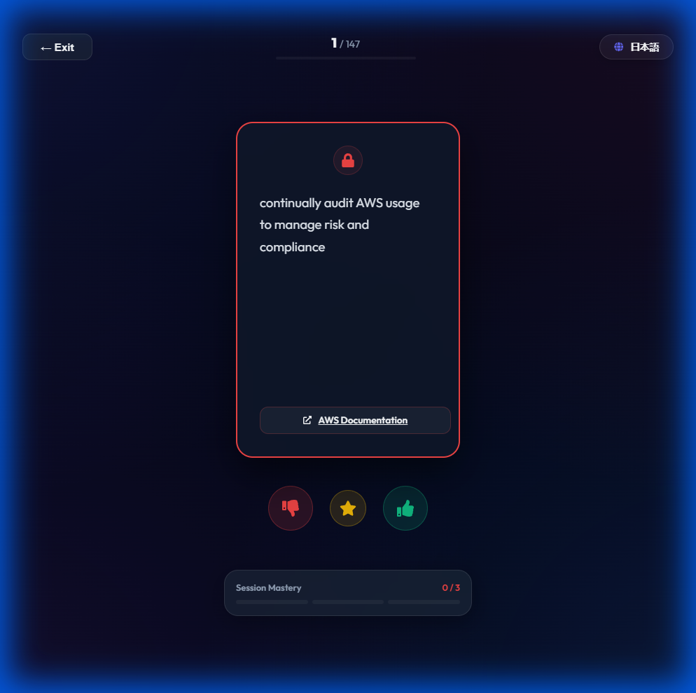
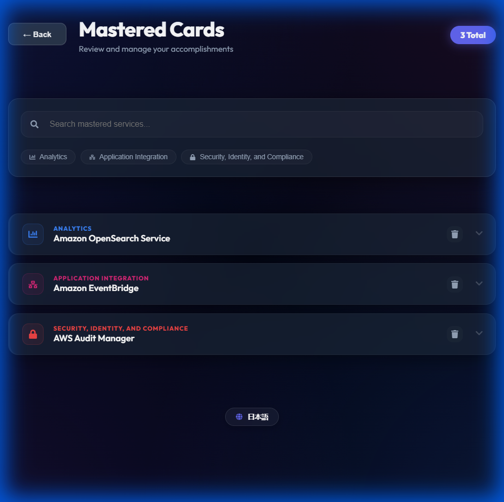

# AWS Cloud Practitioner Prep App

## Project Overview
A modern, interactive flashcard application designed to help users prepare for the AWS Cloud Practitioner exam. The app features a premium glassmorphic design, a spaced-repetition inspired mastery system, intuitive gesture controls, and a comprehensive dashboard.

---

## 📸 App Page Preview

### Dashboard


### Study Mode (Card Front & Back)
<div style="display: flex; gap: 10px;">
  
  
</div>

### Mastered List


---

## 🚀 How to Run

### Prerequisites
*   [Node.js](https://nodejs.org/) (v16 or higher recommended)
*   npm (comes with Node.js)

### Installation
1.  Clone the repository or download the source code.
2.  Open your terminal/command prompt in the project folder.
3.  Install dependencies:
    ```bash
    npm install
    ```

### Running Locally
To start the development server:
```bash
npm run dev
```
Then open your browser to the URL shown (usually `http://localhost:5173`).

### Building for Production
To create an optimized build for deployment (e.g., Netlify, Vercel):
```bash
npm run build
```
The output will be in the `dist/` folder.

---

## 🎨 Design & Aesthetics

### Premium UI/UX
The application features a state-of-the-art **Glassmorphism** design language:
*   **Immersive Backgrounds**: A dynamic, animated mesh gradient background that creates a modern, high-end feel.
*   **Refined Color System**: Strategic use of category-specific colors (e.g., Pink for Application Integration, Orange for Compute) for instant visual recognition.
*   **Glass Panels**: Sophisticated use of background blurs (`backdrop-filter`) and semi-transparent surfaces for a clean, layered interface.
*   **Persistent Branding**: Category cards and flashcards feature bold, persistent borders in their respective theme colors.

---

## 📋 Specifications & Features

### 1. Interactive Study Mode
*   **Flashcards**: Double-sided cards with **3D flip animations**. The front of the card uses the category's theme color, while the back provides detailed AWS service descriptions and documentation links.
*   **Gestures**: Swipe right (Thumb Up) for "Correct" and swipe left (Thumb Down) for "Incorrect".
*   **Mastery System**:
    *   **Session Progress**: Visual tracker (0/3 notches) on every card to monitor cumulative mastery.
    *   **Strict Reinforcement**: Requires multiple cumulative correct answers to master a card. A single wrong answer resets mastery progress, ensuring deep conceptual understanding.
    *   **Instant Master**: Gold Star button to immediately mark a known concept as mastered.
*   **Mobile Optimized**: Responsive layout ensuring accessible buttons and progress tracking on smartphone screens.

### 2. Dashboard
*   **Progress Tracking**:
    *   Overall mastery percentage with a sleek circular progress chart.
    *   Breakdown by AWS Section (Security, Compute, Storage, etc.) with category-specific progress bars.
    *   Staggered animations for a professional, high-end load experience.
*   **Quick Actions**: Start random study sessions or dive into specific categorized sections.

### 3. Mastered Cards Management
*   **Premium List View**: A refined view of all mastered items with sleek glassmorphic list items.
*   **Advanced Filtering**:
    *   **Search**: Real-time text search by service name or section.
    *   **Smart Chips**: Interactive section badges for rapid list filtering.
*   **Management**: Delist (un-master) items you wish to revisit in your study sessions.

### 4. Internationalization (i18n)
*   **Multilingual Support**: Seamless switching between **English** and **Japanese** (日本語).
*   **Dynamic Language Toggle**: A floating, glassmorphic language switcher accessible across all views.
*   **Localized Content**: Fully translated UI and dynamically loaded localized datasets.

## 🛠 Tech Stack
*   **Framework**: React (Vite)
*   **Internationalization**: `react-i18next` & `i18next`
*   **Styling**: Vanilla CSS with advanced CSS Variables and `backdrop-filter`.
*   **Animations**: `framer-motion` for fluid, staggered transitions and 3D effects.
*   **Data Handling**: `papaparse` for CSV data loading.
*   **Persistence**: `localStorage` (Offline/Local save).
*   **Icons**: `react-icons` (FontAwesome).

## File Structure
*   `src/components/`: UI Components (Card, StudyMode, Dashboard, MasteredList, LanguageToggle).
*   `src/utils/`: Logic for storage, CSV parsing, and theming.
*   `public/`: Static assets (CSV data, logos).
*   `src/i18n.js`: Configuration for internationalization.

---
